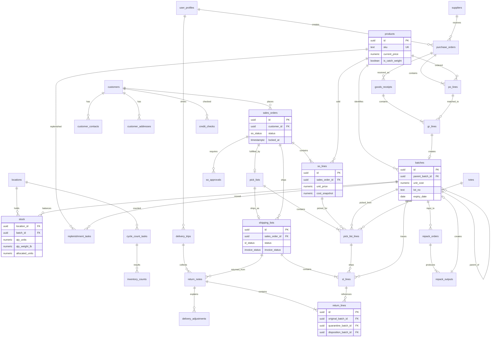

# 核心实体关系图（Phases 1–9）

```mermaid
erDiagram
  user_profiles ||--o{ purchase_orders : creates
  suppliers ||--o{ purchase_orders : receives
  purchase_orders ||--|{ po_lines : contains
  purchase_orders ||--o{ goods_receipts : received_as
  goods_receipts ||--|{ gr_lines : contains
  po_lines ||--o{ gr_lines : matched_to
  products ||--o{ po_lines : ordered
  products ||--o{ batches : identifies
  gr_lines ||--o| batches : creates

  batches ||--o{ batches : parent_of
  locations ||--o{ stock : holds
  batches ||--o{ stock : balances
  products ||--o{ replenishment_tasks : replenished
  batches ||--o{ replenishment_tasks : moved
  locations ||--o{ cycle_count_tasks : counted
  cycle_count_tasks ||--o{ inventory_counts : results

  customers ||--o{ customer_contacts : has
  customers ||--o{ customer_addresses : has
  customers ||--o{ sales_orders : places
  customers ||--o{ credit_checks : checked
  sales_orders ||--|{ so_lines : contains
  products ||--o{ so_lines : sold
  sales_orders ||--o{ so_approvals : requires

  sales_orders ||--o| pick_lists : fulfilled_by
  pick_lists ||--|{ pick_list_lines : contains
  so_lines ||--o{ pick_list_lines : picked_for
  batches ||--o{ pick_list_lines : picked_from
  totes ||--o{ pick_list_lines : carries

  pick_lists ||--o| shipping_lists : ships_as
  sales_orders ||--o{ shipping_lists : ships
  shipping_lists ||--|{ sl_lines : contains
  pick_list_lines ||--o{ sl_lines : ships
  batches ||--o{ sl_lines : traces

  user_profiles ||--o{ delivery_trips : drives
  delivery_trips ||--o{ return_notes : collects
  shipping_lists ||--o{ return_notes : returned_from
  return_notes ||--|{ return_lines : contains
  sl_lines ||--o{ return_lines : references
  return_notes ||--o{ delivery_adjustments : explains

  batches ||--o{ repack_orders : input_to
  repack_orders ||--|{ repack_outputs : produces
  repack_outputs ||--o| batches : creates

  products {
    uuid id PK
    text sku UK
    numeric current_price
    boolean is_catch_weight
  }
  batches {
    uuid id PK
    uuid parent_batch_id FK
    numeric unit_cost
    text lot_no
    date expiry_date
  }
  stock {
    uuid location_id FK
    uuid batch_id FK
    numeric qty_units
    numeric qty_weight_lb
    numeric allocated_units
  }
  sales_orders {
    uuid id PK
    uuid customer_id FK
    so_status status
    timestamptz locked_at
  }
  so_lines {
    uuid id PK
    uuid sales_order_id FK
    numeric unit_price
    numeric cost_snapshot
  }
  shipping_lists {
    uuid id PK
    uuid sales_order_id FK
    sl_status status
    invoice_status invoice_status
  }
  return_lines {
    uuid id PK
    uuid original_batch_id FK
    uuid quarantine_batch_id FK
    uuid disposition_batch_id FK
  }
```

为保持可读性，图中省略 settings、audit_log、price_history、price_change_alerts、doc_counters 等辅助实体；完整清单见 `tables.md`。
